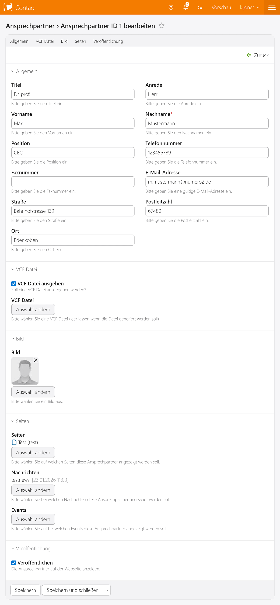

Contao Contact Persons Bundle
=======================

[](https://packagist.org/packages/numero2/contao-contact-persons) [](http://www.gnu.org/licenses/lgpl-3.0)

About
--

This bundle allows you to **manage contact persons for individual pages, news items, or events**.

**Features**

- Manage contact persons for pages, news, or events.
- A dedicated **content element** to:
  - display a single contact person, or
  - output a **list of selected contact persons**
- Optionally attach a **VCF file** to each contact person
- Alternatively, automatically generate a VCF file from the information stored in the backend for download

Screenshot
--



System requirements
--

* [Contao 5.0](https://github.com/contao/contao) (or newer)

Installation
--

* Install via Contao Manager or Composer (`composer require numero2/contao-contact-persons`)
* Run a database update via the Contao Manager or using the [contao:migrate](https://docs.contao.org/dev/reference/commands/) command.


Events
--

If you want to extend the contact persons using your own fields you can use the `contao.contact_person_parse` event to modify all the data that will be used in the templates.

```php
// src/EventListener/ContactPersonParseListener.php
namespace App\EventListener;

use numero2\ContactPersonsBundle\Event\ContactPersonEvents;
use numero2\ContactPersonsBundle\Event\ContactPersonParseEvent;
use Symfony\Component\EventDispatcher\Attribute\AsEventListener;

#[AsEventListener(ContactPersonEvents::CONTACT_PERSON_PARSE)]
class ContactPersonListener {

    public function __invoke( ContactPersonParseEvent $event ): void {
        // …
    }
}
```
